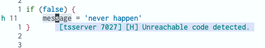

# Coc.nvim intelliSense: Code Action 

Given the following typescript code:

```ts
if (false) {
  message = 'never happen'
}
```

coc.nvim will warn about a potential problem:



This is the same as the following in VSCode:


In VSCode when you press `⌘.` a  **quick fix** menu appears:


In Coc-nvim, the equivalent for triggering VSCode's quick-fix menu is to call the **Code Action**. The mapping for this in my coc-vim setup is:

```txt
  "/ Remap keys for applying codeAction to the current buffer.
  nmap <space>ac  <Plug>(coc-codeaction)
```
This will bring up the menu:


Also see:
https://github.com/fannheyward/coc-rust-analyzer/issues/492


