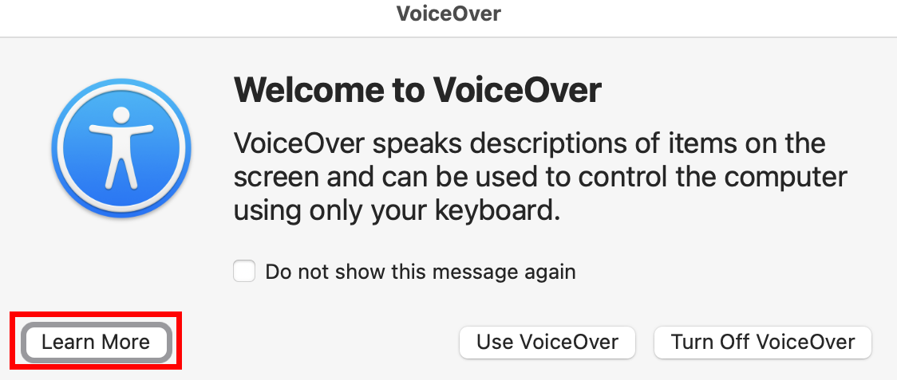
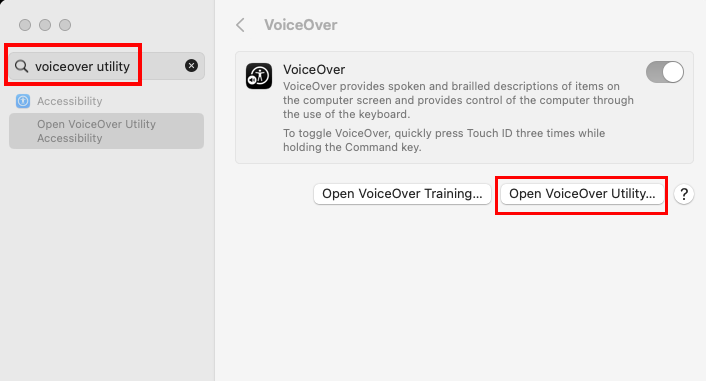
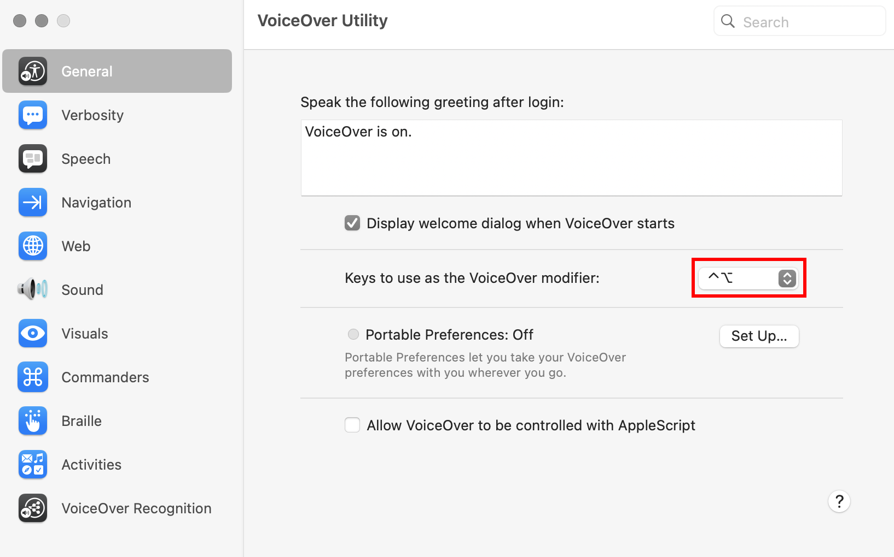
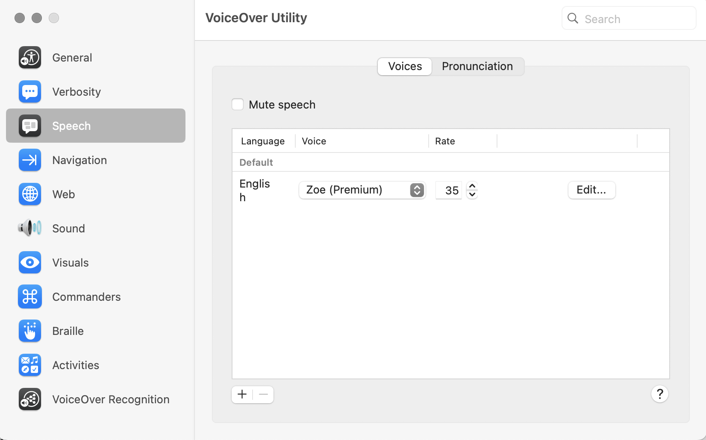

## Accessing VoiceOver training

Your mac comes with a tutorial for VoiceOver. You can access this tutorial in the `voiceOver dialogue`. 

To open this dialogue, press:

```
Command-F5
```



Then click `Learn More` in the dialogue.

This article is the note I made while going through this VoiceOver training.

---
## 1 The VoiceOver Quick Start:

## 2 Practice what you learn:

## 3 VoiceOver modifier and VoiceOver-Utitlity:

You can find out the keyboard mapping of VoiceOver modifier in `VoiceOver utility`. 

*If you already know your VoiceOver mapping, you can go to the VoiceOver utility directly with `VO-F8` when **VoiceOver is ON**. (but this required you already know your VoiceOver keyboard mapping)*

To access the `VoiceOver utility`:
```txt
Apple menu > System setting > search "voiceover utility".
```



click `Open VoiceOver Utility...` and you will see your VoiceOver modifier mapping:




## 4 VoiceOver keyboard Help:

Press `VO-k` will enter the keyboard help mode.  
Press `[escape]` key to exit the keyboard help.

When you are in keyboard help mode, press `VO` then follows with a key you want to get help, voiceOver will say the description of the key you requested. 

## 5 Move around the screen:

Press `VO-[Arrowkey]` to move around.


## 6 Adjust the voice:

Panel 6 shows you how to configure the voice, but it is easier to configure this in:

`VoiceOver Utility` > `Speech`

