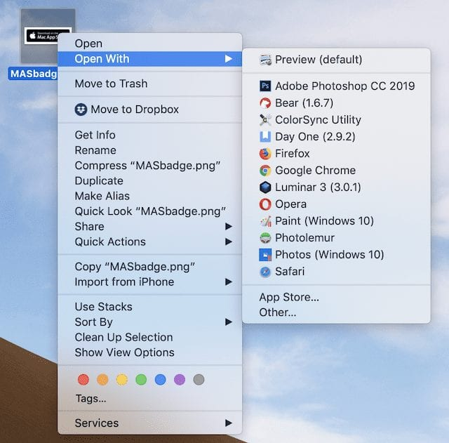

# Rebuilding the Launch Services database

## What is Open with launch menu

This is the **launch menu**, it is opened when you right click and items in finder:

## What could go wrong with open with menu?

Symptoms of a launch service database that hasn’t been rebuilt in a long time:

- apps that appear in the **Open With** menu that aren’t usable. 
- it takes your Mac an unusually long time to generate the list. 
- apps in the list that were deleted from your Mac long ago.

## How to rebuild open with menu?

I know two way of rebuild launch service database:

1. **lsregister:** command for LaunchServices
2. free **[OnyX](https://www.titanium-software.fr/en/index.html) utility** from Titanium Software

You can read more about lsregister here:

https://eclecticlight.co/2019/03/25/lsregister-a-valuable-undocumented-command-for-launchservices/

you can read the manual of lsregister here:

https://ss64.com/mac/lsregister.html

---
**References**:

https://eshop.macsales.com/blog/47149-quick-tip-managing-macos-file-associations