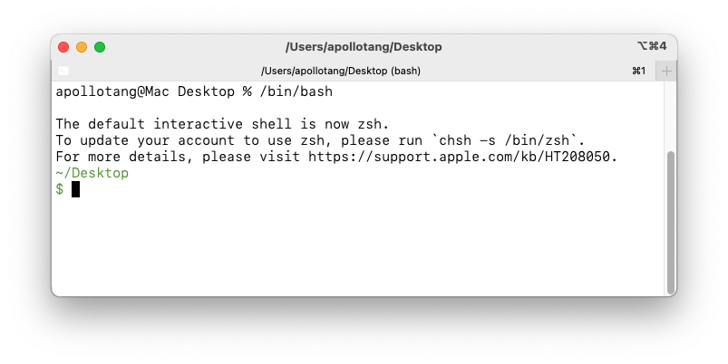

# How to change osx default shell to Bash

The Bash came with osx located at `/bin/bash` is broken or its out of date. Invoking it you will see: 


So you have install bash via brew. 

After installation it  will be located at: 

```zsh
$ brew --prefix bash
/opt/homebrew/opt/bash
```

With new Bash install you can change the default shell using the command: 

```zsh
$ chsh -s /opt/homebrew/opt/bash
```

But above will not work because `chsh` will only accept a shell listed in the file `/etc/shells`.

So you have to add `/opt/homebrew/opt/bash` to the file `/etc/shells` .

However we cannot edit the file `/etc/shells`.  How to get arround?  Here is the trick to added add `/opt/homebrew/opt/bash` to the file `/etc/shells`  from: [Unable to modify /etc/shells on macOS to include brew installed version of bash - Stack Overflow](https://stackoverflow.com/questions/49048720/unable-to-modify-etc-shells-on-macos-to-include-brew-installed-version-of-bash/52554474#52554474) : 

```bash
$ sudo sh -c "echo $(which bash) >> /etc/shells"  # Trick a line to /etc/shells
$ chsh -s $(which bash)
```

In the above can use `$(which bash)` to get `/opt/homebrew/opt/bash` because I have already that `/opt/homebrew/opt/bash` to my PATH environment variable.

Details see:  [Changing default shell from zsh to bash on MacOS (Catalina and beyond) - Stack Overflow](https://stackoverflow.com/questions/77052638/changing-default-shell-from-zsh-to-bash-on-macos-catalina-and-beyond) 


Another way to change shell is use ` > System Settings`, then click Users & Groups. **Note that you have to Control-click** your user name or user picture in the list of users on the right, to see **Advanced Options**. However this method does not work because you cannot navigate to `/opt/homebrew/opt/bash`  as `/opt`is a hidden direactory.  

see:  

[Use zsh as the default shell on your Mac - Apple Support](https://support.apple.com/en-us/102360) 

[How to Change the Default Shell to Bash on macOS](https://www.howtogeek.com/444596/how-to-change-the-default-shell-to-bash-in-macos-catalina/#:~:text=cat%20/etc/shells-,Change%20from%20Zsh%20to%20Bash%20In%20System%20Settings,OK%22%20to%20save%20your%20changes.) .

[macos - Can't access /etc folder in OS X Mountain Lion - Ask Different](https://apple.stackexchange.com/questions/76611/cant-access-etc-folder-in-os-x-mountain-lion#:~:text=2%20Answers,kind%20of%20access%20he%20need.) 


 