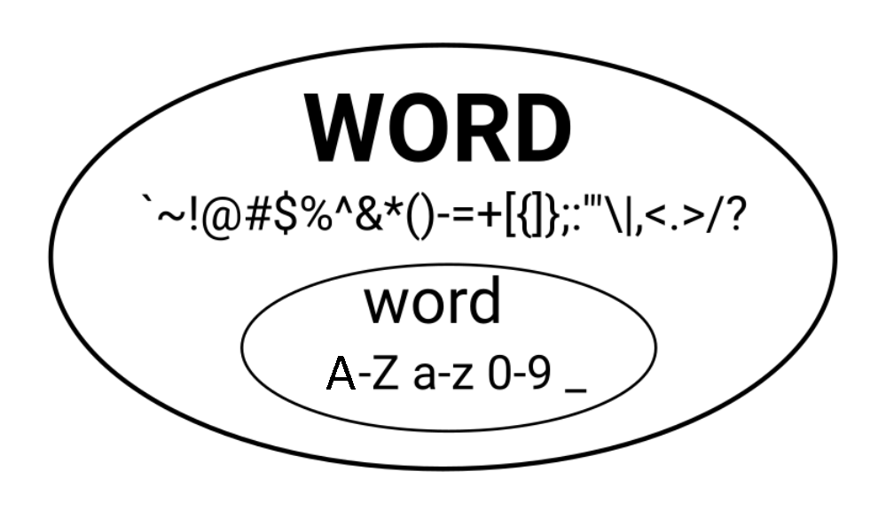

# word vs WORD

`WORD` is bigger than `word`. It is a superset of `word`.

**word** 
- A word is delimited by *non-keyword* characters
- *non-keyword* characters: whitespace character, `( ) [ ], -` etc

**WORD** 
- A WORD  is always delimited by whitespace.

**tips**: During coding we use `w`, because we want to move thru *non-keyword* `( ) [ ], -` etc. After all, *non-keyword* in programming has special meaning. However, if you are writing a novel `W` is more useful because we are rarely concern with *non-keyword*, you simply want to jusp to the next word.

**help**: `:h 03.1`

Ref: 

[SO: vim-word-vs-word](https://stackoverflow.com/questions/22931032/vim-word-vs-word)