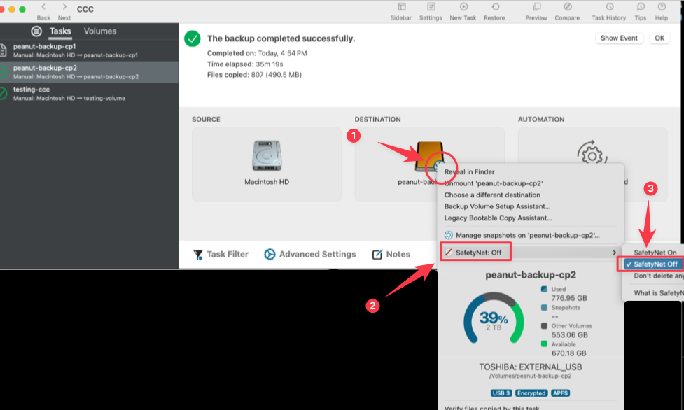
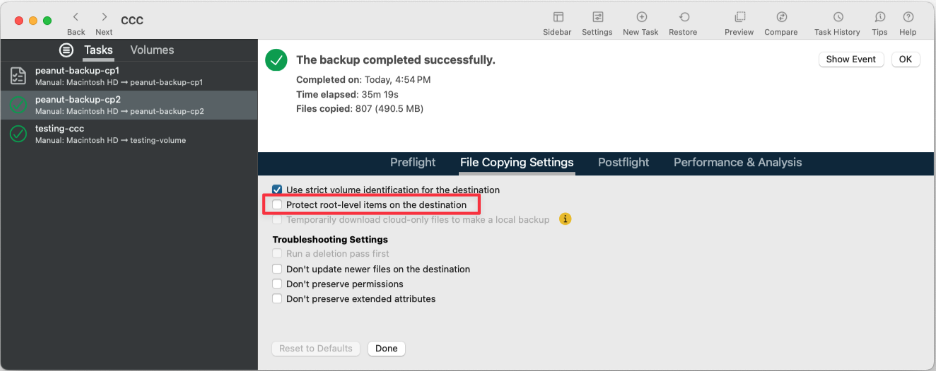
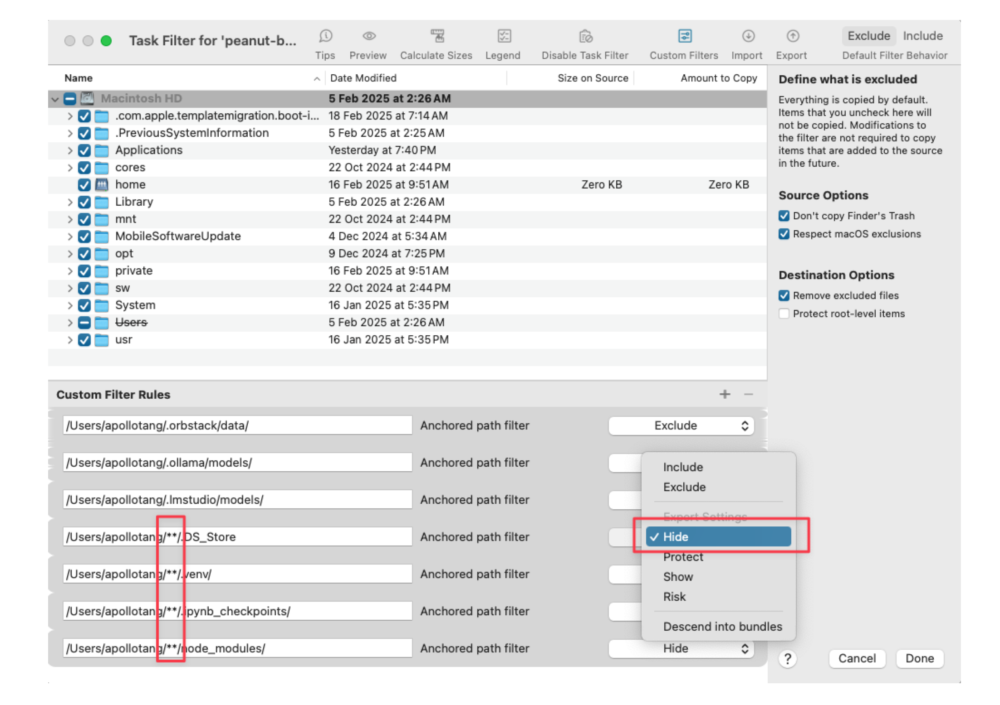
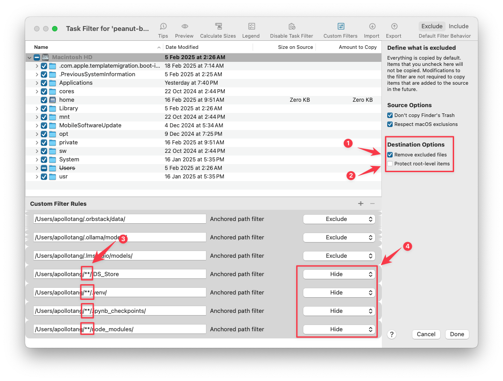

# safetyNet setting

From:  [CCC SafetyNet: Temporary protection for destination content – CCC Knowledge Base](https://support.bombich.com/hc/en-us/articles/20686475366935-CCC-SafetyNet-Temporary-protection-for-destination-content) 

>  SafetyNet is a **safety mechanism** that is designed to avoid immediate loss of data if you were to accidentally select a destination to a CCC backup task that is not intended to be managed exclusively by CCC.

> We recommend that you [create a volume on your destination device for each source](https://support.bombich.com/hc/articles/20686485252759#apfs_add_volume) that you want to back up, and use that volume exclusively with CCC. When this exclusivity is defined, disable the SafetyNet feature – click on the Destination selector and choose "SafetyNet Off" from the SafetyNet submenu.

## :warning: Some configuration can prevent deleted items being removed from destination

1. root-level items is protected on the destination
2. Task Filter configuration

### 1. Root-level items is protected on the destination 

Advance setting > File Copying Setting: 

Make sure "Protect root-level items on the destination" is unchecked

### 2. Task Filter configuration

[Configure the task filter to exclude files and folders from a task – CCC Knowledge Base](https://support.bombich.com/hc/en-us/articles/20686509510167-Configure-the-task-filter-to-exclude-files-and-folders-from-a-task#h_01HPZ3FZ45M32Q0007XQ1BFR7N) 

**Meaning of these drop downs under "Custom filter rules":**

Exclusions setting in custom filter 

> Custom filter rules are usually applied to include or exclude an item. Exclusions, however, are actually composed of two behaviors: a matching item on the source will not be copied (**Hide** the item from the copier), and a matching item on the destination will be protected (**Protect** the item from the copier).

Inclusions setting in custom filter 

> Inclusions indicate that a matching item on the source will be copied (**Show** the item to the copier) and a matching item on the destination may be deleted (**Risk** the item).

### Correct configuration:

:warning: Note the following configuration in **Destination options:**

1. "Destination options > Remove excluded files" is checked
2. "Destination options > Protect roo-level items" is unchecked

:warning: Note the following configuration in **Custom Filter Rules:**

If wildcard characters ``/**/``  is used (3) make sure drop down is set to "Hide" (4)

Also read my email with support@bombich.com on Feb 16, 2025, 6:23 PM, 
Subject: "[Request received] Safety Net is off but deleted item is not removed from backup"

