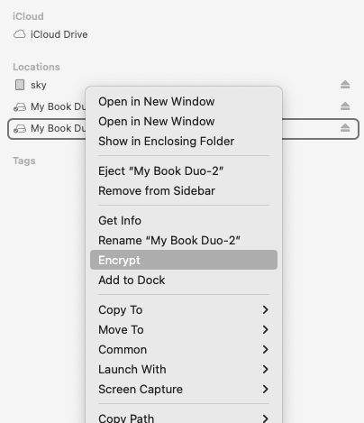
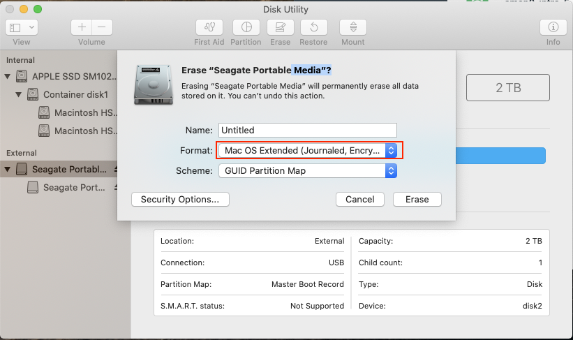

# How to Encrypt External Drive

In Finder's sidebar, right-click on the partition and choose Encrypt.

Ref: https://apple.stackexchange.com/a/221367/282542 

---

## Encrypting External Drive with Disk utility (deprecated)

:warning::warning: The Disk Utility's Mac OS Extended (Journaled, Encrypted) is no longer available:

Here are the steps:

1.  Open Disk Utility and click on the drive (not the partition)
2.  Click Erase button
3.  Choose Name
4.  Choose Format: OS X Extended (Journaled)
5.  Choose Scheme: GUID Partition Map
6.  Click Erase button
7.  When complete, open Finder
8.  Right-click on the new drive partition
9.  Select Encrypt
10. Enter passwords
11. Finish

### Why don't just use APFS (Encrypted)?

According to this article [2] APFS performance on the slower in 5400RPM HDDs.

Ref: [2] https://bombich.com/blog/2019/09/12/analysis-apfs-enumeration-performance-on-rotational-hard-drives  

