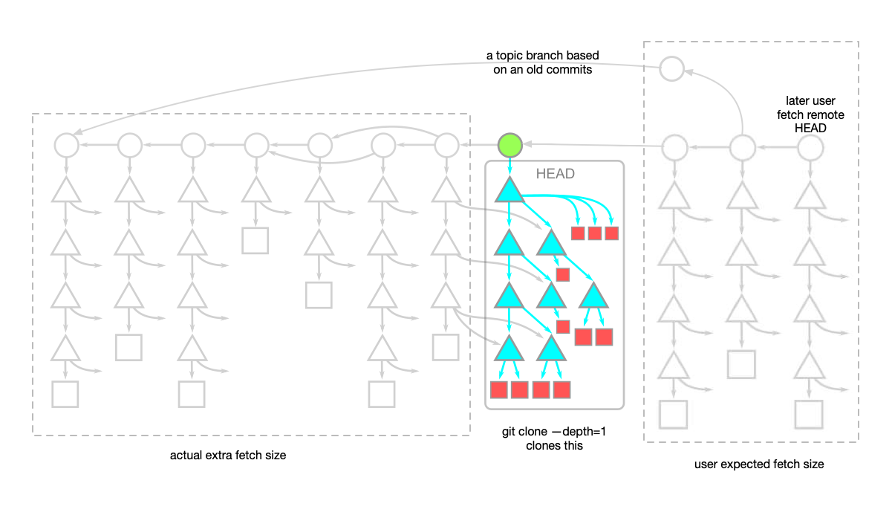
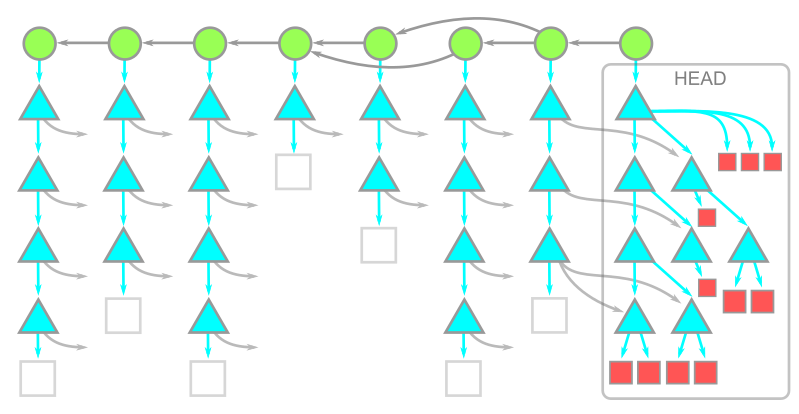
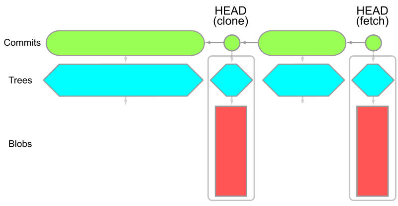

# Use git partial clone instead of shallow clone  

Reading note for  [Get up to speed with partial clone and shallow clone - The GitHub Blog](https://github.blog/open-source/git/get-up-to-speed-with-partial-clone-and-shallow-clone/) 

## TL;DR:

If you are cloning for CI builds, use **shallow clone**:

```
git clone --depth=1 <url>
```

If your repository is large, use **partial blobless clone**:

```
git clone --filter=blob:none <url>
```

Don't use a treeless partial clone.

## Introduction

When cloning a large repository with a long history, it often takes a significant amount of time and consumes a lot of storage space on your computer. Typically, we just want to clone the repository quickly and start working, without downloading every version of every file in the entire Git history. To achieve this, we were often told to use a **shallow clone**. However, this article advises against relying on shallow clones for most use cases. Instead, it recommends using **partial clones**.

## What is shallow clone? 

Shallow clones use the [`--depth=parameter`](https://git-scm.com/docs/git-clone#Documentation/git-clone.txt-code--depthcodeemltdepthgtem) of `git clone` to truncate the commit history when depth is one:

```
git clone --depth=1 <url>
```

It copies only the content under the *root tree* of HEAD commit.  Connection to its parents (ie., the history) is severed. 


### Why don't use shallow clone? 

Shallow cloning limits the functionality of certain Git commands due to the lack of local history.  

Commands such as `git merge-base`, `git blame`  or `git log` will give you false results, because the history is not present locally. 

The command `git fetch` can take longer because it might need to download almost the full history if a new topic branch is based on older commits. The following diatram illustrated this:



### When to use shallow clone?

Although the article discourages the use of shallow clones for general purposes, it highlights their usefulness in specific workflows. For example, during a CI build, where a single clone and deletion of the repository occur immediately, shallow clones are ideal.

To summarize, use shallow clones when:

- You only need a copy of the working directory at the tip commit.
- You do not plan to use Git's distributed workflows and functionality extensively.

## What are partial clones?

Partial clone are achieved with the  the [`--filter` option](https://git-scm.com/docs/git-clone#Documentation/git-clone.txt---filterltfilter-specgt)  in `git clone` command. The article discusses two types of partial clones:

1. **Blobless partial clone**: `git clone --filter=blob:none <url>`
2. **Treeless partial clone**: `git clone --filter=tree:0 <url>`


## Blobless partial clone

Blobless clones download all reachable commits and tree objects, but download of the blobs (file contents) only limit to that under the *root tree* of the HEAD commit (red in the illustration below): 



For commands such as `git checkout` , `git fetch`, `git diff` or `git blame <path>`, blobs are downloaded on demand and are limited to the blobs required for the specific operation, thus minimizing unnecessary data transfer. The following diagram illustrates that `git fetch` only download blobs under the commit pointed to by HEAD: 



Blobs fetched on demand are downloaded only once. Subsequent operations that require the same blobs do not trigger additional downloads. 

Since all trees in the history are available locally, commands like `git merge-base`, `git log`, or `git log -- <path>` work as expected without additional download. This is because tree objects contain path entries and object IDs, which are sufficient for these operations to function fully.

### When to use blobless partial clone?

Use blobless clones when:

- Your repository takes a long time to clone due to its size.
- It is a monorepo containing multiple projects.
- The repository contains large binary files or assets (e.g., game assets).

### Trade-offs in blobless partial clone

Some operations (e.g., `git checkout`, `git diff`, or `git blame`) may take longer because they require downloading blob data on demand.


## Treeless partial clone

Treeless clones further improve cloning speed and local storage space by skipping download historical  tree objects:


The missing trees and blobs is requested on demand, but they are inefficient.  For example, during `git checkout`, git client does not tell the server it already has some of the required root trees, so the server might send the trees again. 

Operation such as `git merge-base` or basic `git log` does not required historical tree, and will perform efficiently.  However, `git log -- <path>` and `git blame` require historical tree and thus trigger downloading for all commit in the histrory.  

The article also mentioned for repositories contain submodules, the `git fetch` operation can also trigger tree request for all new commits, but this can be avoided if you add  `fetch.recurseSubmodules false` to your git configuration.

### When to use treeless partial clone?

Due to the inefficiencies and performance drawbacks, the article discourages using treeless clones for daily development work.

## Comparison of size used in various clone

I made some tests cloning [git/git](https://github.com/git/git) with all four methods, and the following table summarizes storage usage:

| Method                                                    | Size     |
| --------------------------------------------------------- | -------- |
| `git clone git@github.com:git/git.git`                    | 338.9 MB |
| `git clone --filter=blob:none git@github.com:git/git.git` | 178.5 MB |
| `git clone --filter=tree:0 git@github.com:git/git.git`    | 178.5 MB |
| `git clone --depth=1 git@github.com:git/git.git`          | 69.9 MB  |

## When to use full clone? 

This article does not discourage using full clones entirely. Instead, it suggests that full clones remain the best option for developers who:

- Need a distributed workflow.
- Want all data locally for comprehensive history and development.
- Work with reasonably sized repositories.


## Related reading:

[Commits are snapshots, not diffs - The GitHub Blog](https://github.blog/open-source/git/commits-are-snapshots-not-diffs/) 

[Git clone: a data-driven study on cloning behaviors - The GitHub Blog](https://github.blog/open-source/git/git-clone-a-data-driven-study-on-cloning-behaviors/) 

[Counting Objects - The GitHub Blog](https://github.blog/open-source/git/counting-objects/) 

[Git - Git Objects](https://git-scm.com/book/en/v2/Git-Internals-Git-Objects) 


[Optimize your monorepo experience - GitHub Universe 2020 - YouTube](https://www.youtube.com/watch?v=RcqLV1lU408&t=740s) 

[How to clone only some directories from a git repository? - Ask Ubuntu](https://askubuntu.com/questions/460885/how-to-clone-only-some-directories-from-a-git-repository) 
