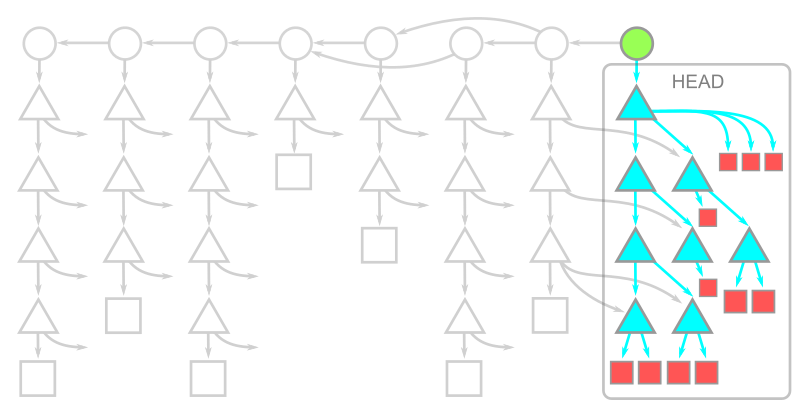
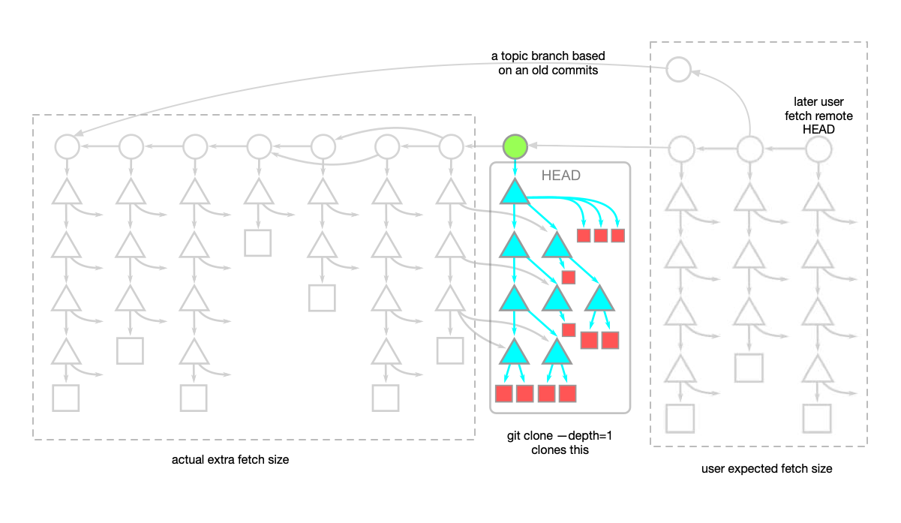
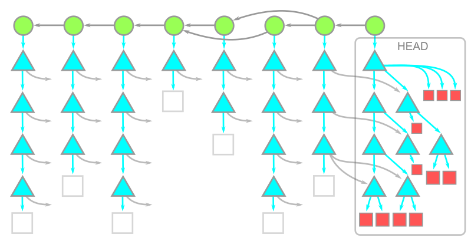
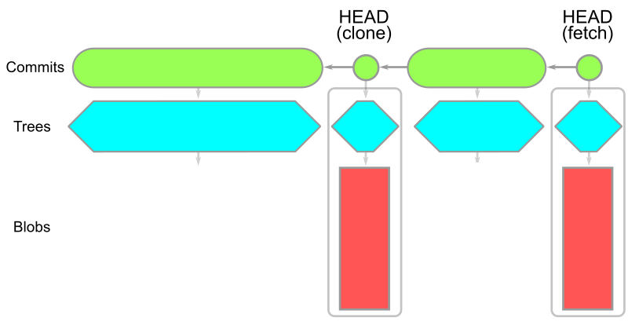
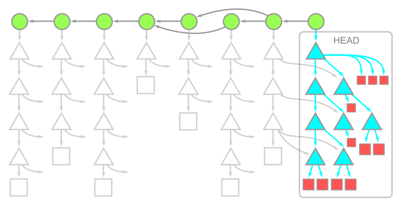
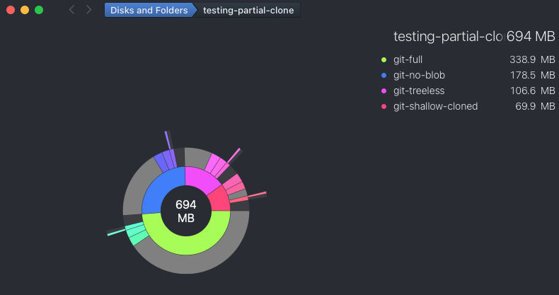

# Use partial clone instead of shallow clone  

Reading note for  [Get up to speed with partial clone and shallow clone - The GitHub Blog](https://github.blog/open-source/git/get-up-to-speed-with-partial-clone-and-shallow-clone/) 

Often when cloninging a large repository with long history, not only it takes long time to cloning,  the repository also take up a lot of space on our compouter.  Often we just want to clone the reposity quickly and get starting working.  There is no need to download every version of every file in the entire git history.  To achieve this we were often told to use **shallow clone**. However, this article advise not to use shallow clone. Instead, it is advised that we use **partial clone**. 

### What is shallow clone? 

Shallow clones use the [`--depth=parameter`](https://git-scm.com/docs/git-clone#Documentation/git-clone.txt-code--depthcodeemltdepthgtem) of `git clone` to truncate the commit history when depth is one:

```
git clone --depth=1 <url>
```

It copies only the content under the *root tree* of HEAD commit.  Connection to its parents (ie., the history) is severed. 



### Why don't use shallow clone? 

When you shallow clone a repository, some git functionalities in your shallow cloned repository may have different behaviours. 

Commands such as `git merge-base`, `git blame`  or `git log` will give you false results, because the history is not present locally. 

The command `git fetch` will take longer to execuse because it may have to download almost a full history if a newer topic branch to fetch from remote is based historical commit. The following diatram illustrated this:



### What are partial clones?

Partial clone are achieved with the  the [`--filter` option](https://git-scm.com/docs/git-clone#Documentation/git-clone.txt---filterltfilter-specgt)  in your `git clone` command. The article mentions two type of partial clone: 

1. blobless partial clone: `git clone --filter=blob:none <url>`
2. Treeless partial clone:  `git clone --filter=tree:0 <url>`

### Blobless partial clone

Blobless clones will download all reachable commits and trees, and only download the blobs under the *root tree* of HEAD commit:



It is important to notice that other then the blobs under the root tree of HEAD commit, blobs contain under the history commits are not download until later when you perform `git checkout` .  And when you do `git checkout`, only the blobs under the commit you checkout will be downloaded.  When running `git fetch`,  only remote commit **at the tip** point to by the HEAD will be download:



In blobless clone, commands like `git merge-base`, `git log`, or even `git log -- <path>` work with the same performance as a full clone.  This is because all trees in the history were present.  These trees contains path entries and the object ID for the objects at the required paths in question, there are the necessary information for the detections of which commits changed at a given path performed or query by these commands.

When using a blobless clone, you will trigger a blob download whenever you need the *contents* of a file. For example commands like `git diff` or `git blame <path>` require the contents for their calculations. So these required blobs and will thus trigger blob downloads.  However, download only happen onces.  There is no need to download them again when you run these command later. 

### When to use blobless partial clone?

Use it when:

- your repository take long time to clone because is very large (such as monorepo)

- your repository contains many large blobs and will use a lot of disk space locally.

**Trade-off :** 

some commands such as `git checkout`, `git diff`, or `git blame` will take longer because it require downloading  blob data.


### Treeless partial clone




**Trade-off of Treeless clone:**

- it is expensive to download missing trees later. 
- `git log -- <path>` and `git blame` are extremely slow.


### When to use full clone? 

- You need to have a distributed workflow and want all of the data in your local repository 

- You are a developer focused on a single repository and your repository is reasonably-sized


### When to use shallow clone? 

- You only want to get a copy of the working directory at the tip commit

- You do not plan to use any of git's distributed workflow and functionality.  

Quoted from the article:

>  In workflows such as CI builds when there is a need to do a single clone and delete the repository immediately, shallow clones are a good option. **Shallow clones are the fastest way to get a copy of the working directory at the tip commit**


### Content use in various clone:


