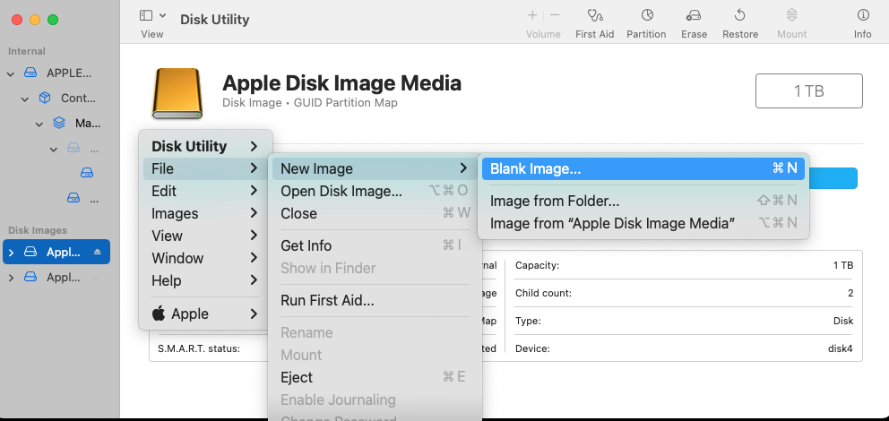
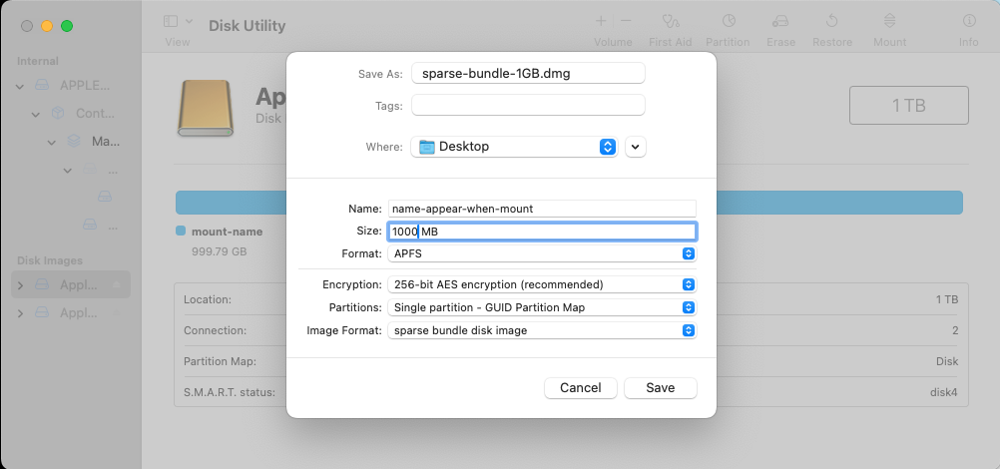
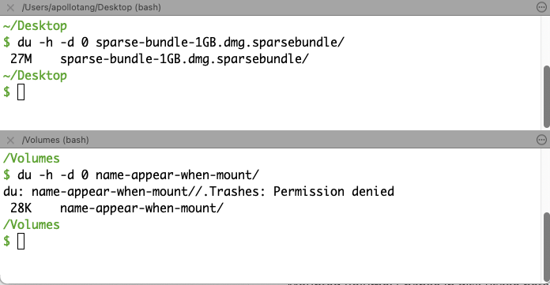
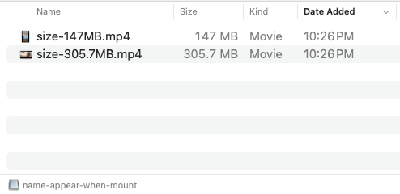
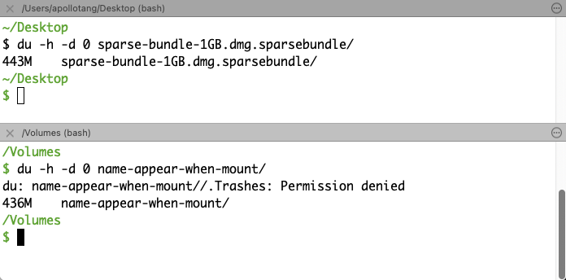

# Creating sparse disk image 


```
Disk Utility > File > New image > Blank Image:
```






Note: the world "bundle" in sparse bundle disk image means "folder". 


## Disk usage change after adding content




Added 2 video files into the mounted volume:






## About the size of sparse disk image

References: [Sparse Disk Image and sizing - Apple Community](https://discussions.apple.com/thread/2197329?sortBy=rank) 


> the size of a sparse image you set at creation time is the maximum size. it has little meaning in the sense that you can set it to be huge and it won't affect how much space the disk image actually takes on the hard drive. if you make a sparse image with max size 100GB but only put 1GB of data on it then it will only take 1GB of data on the drive. this is different from a regular disk image which will take as much space on the drive as the maximum size you set.


### Can I change it?

> you can change the max size of the sparse image from terminal. first unmount it. then run the following terminal command    
>
> ```
> hdiutil resize -size 50g /path/to/sparse/image
> ```
>
> instead of 50g put the max size of the sparse image you want. 50g means 50GB.  
> put the path to the sparse disk image in the command. you can decrease the max size using the command too but there is never any need to do so.


### Also, can a "sparse" disk image shrink?


> one more thing. if you delete some stuff from a sparse image it does not automatically decrease the space it takes on the hard drive. to force it to reclaim that space run the command 
>
> ```
> hdiutil compact /path/to/sparseimage
> ```
