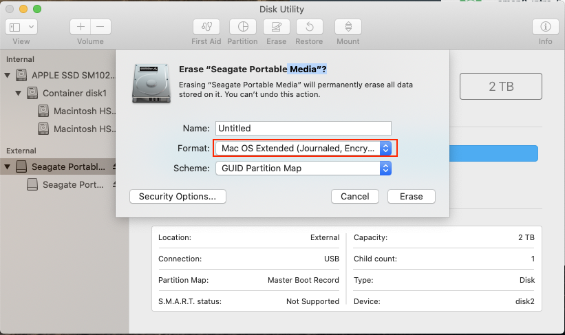

The Disk Utility's Mac OS Extended (Journaled, Encrypted) is no longer available:

To encrypt and external harddrive you can do it in Finder by right-clicking on the partition and choosing Encrypt.

Here are the steps:

1.  Open Disk Utility and click on the drive (not the partition)
2.  Click Erase button
3.  Choose Name
4.  Choose Format: OS X Extended (Journaled)
5.  Choose Scheme: GUID Partition Map
6.  Click Erase button
7.  When complete, open Finder
8.  Right-click on the new drive partition
9.  Select Encrypt
10. Enter passwords
11. Finish

Ref:
https://apple.stackexchange.com/a/221367/282542

---eof---

