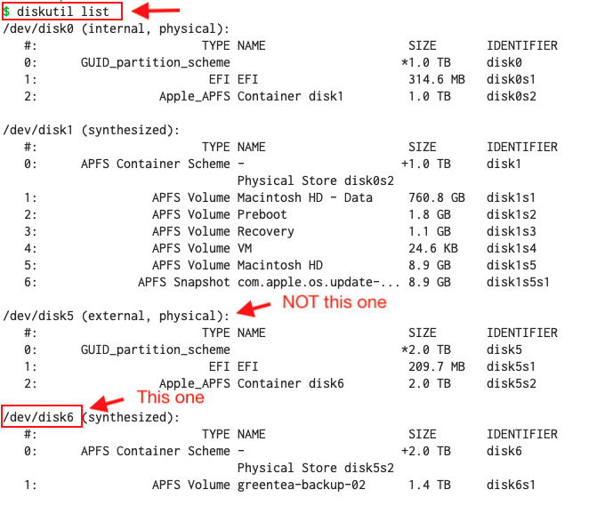
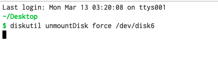

# Force unmount a drive

1. Use the command `diskutil list` to get the device path for the external disk you want to unmount.
2. Then force format with `diskutil unmountDisk force <divice path>`

---

