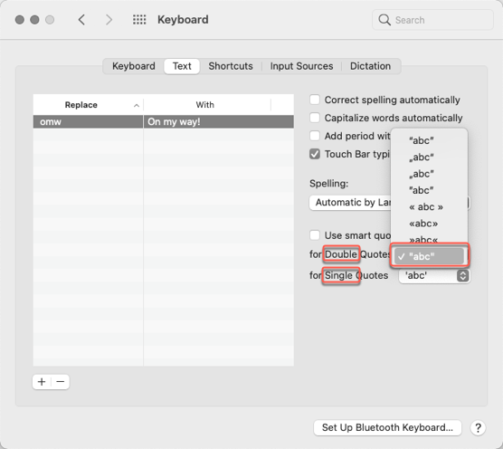
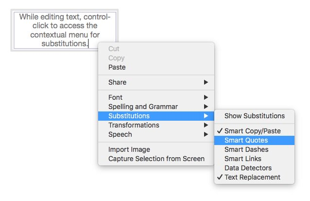

#Turn off smart quotes?

## System wide solution

[https://discourse.omnigroup.com/t/turn-off-smart-quotes/9236/5](https://discourse.omnigroup.com/t/turn-off-smart-quotes/9236/5)

## Application solution

[https://discourse.omnigroup.com/t/turn-off-smart-quotes/9236/6](https://discourse.omnigroup.com/t/turn-off-smart-quotes/9236/6)

While editing text, you can control-click to access the contextual menu for substitutions where you can turn smart quotes on and off. OmniGraffle remembers your preference for that setting (across all documents) until you change it again using that contextual menu item.

