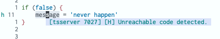
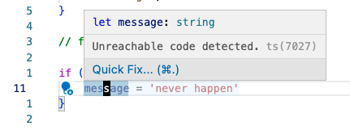
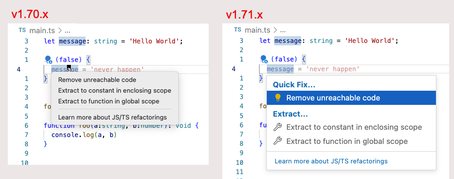

# Coc IntelliSense: Code Action 

Given the following typescript code:

```ts
if (false) {
  message = 'never happen'
}
```

coc.nvim will warn about a potential problem:



This is the same as the following in VSCode:



In VScode when you press `⌘.` a  **Code Action** menu appears:



The **Code Action** menu triggering mapping in my coc.nvim setup is:

```txt
  "/ Remap for do codeAction of current line
  nmap <space>ac  <Plug>(coc-codeaction)
```
This will bring up the menu:


Also see:
https://github.com/fannheyward/coc-rust-analyzer/issues/492


