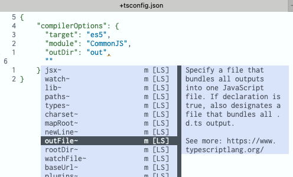
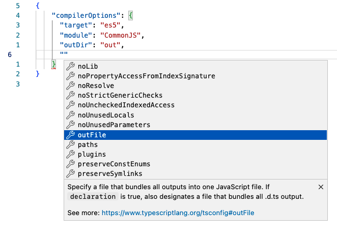

# Coc.nvim trigger completion: coc#refresh()

## tl;dr

With coc.nvim, you can trigger IntelliSense code completions suggestions by pressing `^Space`.  
To navigate up and down the items in the IntelliSense menu use `Tab` and `Shift+Tab`.

---

## Description

For example in the file `tsconfig.json`, if we add a double quote new JSON new entry (line 6):


then placing the cursor between the double quote and then typing `Ctrl+space` coc.nvim will show a menu with all available keys for `"tsconfigOptions"`:



This is similar to VSCode `^space`:



My mapping in `.vimrc` is as follows:

```vimscript
  "/ Use <c-space> to trigger completion. This is same as vscode's Ctrl+Space.
  if has('nvim')
    inoremap <silent><expr> <c-space> coc#refresh()
  elseif has("gui_macvim")
    inoremap <silent><expr> <c-space> coc#refresh()
    "/ My alternative mapping:
    inoremap <silent><expr> <C-o><space> coc#refresh()
    "/ (not sure I still need the above alternate mapping; I will consider remove it in the future)
  else
    "/ Vim in terminal pressing 'Ctrl+space' is triggering  <c-@> instead of <c-space>
    "/ see: https://github.com/neoclide/coc.nvim/issues/2176
    inoremap <silent><expr> <c-@> coc#refresh()
  endif
```

https://github.com/ApolloTang/vimrc/blob/master/dot-vimrc#L309

Note that I have an alternative mapping:
```
inoremap <silent><expr> <C-o><space> coc#refresh()
```

I can't remember why I added it. Maybe it was not necessary, and I will consider removing it in the future.

The mapping in .vimrc for navigating items in the IntelliSense is as follows:

```
  "/ Use <tab> and <S-tab> to navigate completion list:
  "/ NOTE:
  "/   Use command ':verbose imap <tab>' to make sure tab is not re-mapped by
  "/   other plugin otherwise the following will not work.
    inoremap <silent><expr> <TAB>
          \ coc#pum#visible() ? coc#pum#next(1):
          \ <SID>CheckBackSpace() ? "\<TAB>" :
          \ coc#refresh()
    inoremap <expr><S-TAB> coc#pum#visible() ? coc#pum#prev(1) : "\<S-TAB>"

      function! CheckBackSpace() abort
        let col = col('.') - 1
        return !col || getline('.')[col - 1]  =~ '\s'
      endfunction
```


