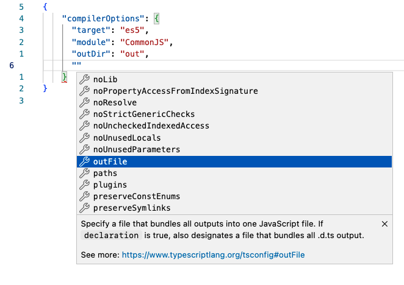

# Coc IntelliSense: Ctrl+Space

Pressing `Ctrl+space` will give you helpful hint.  

For example in the file `tsconfig.json`, we add a double quote as new entry (line 6):


then placing the cursor between the double quote and press `Ctrl+space`  coc.nvim will show a menu with all available key for `"tsconfigOptions"`:


This VSCode equivalent of the above will look like this:



My mapping in vimrc are as follow:

```vimscript
  "/ Use <c-space> to trigger completion. This is same as vscode's Ctrl+Space.
  if has('nvim')
    inoremap <silent><expr> <c-space> coc#refresh()
  elseif has("gui_macvim")
    inoremap <silent><expr> <c-space> coc#refresh()
    "/ My alternative mapping:
    inoremap <silent><expr> <C-o><space> coc#refresh()
    "/ (not sure I still need the above alternate mapping; I will consider remove it in the future)
  else
    "/ Vim in terminal pressing 'Ctrl+space' is triggering  <c-@> instead of <c-space>
    "/ see: https://github.com/neoclide/coc.nvim/issues/2176
    inoremap <silent><expr> <c-@> coc#refresh()
  endif
```

https://github.com/ApolloTang/vimrc/blob/master/dot-vimrc#L309

Note that I have an alternative mapping:
```
inoremap <silent><expr> <C-o><space> coc#refresh()
```

I can't remember why I added it. May be it was not necessary, and I will consider remove it in the future.


