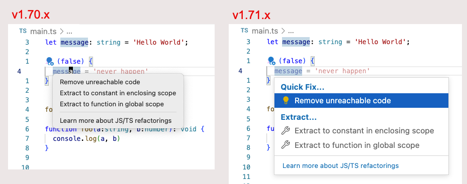

# Coc.nvim IntelliSense


## Quick Fixes

Given the following typescript code:

```ts
if (false) {
  message = 'never happen'
}
```

coc.nvim will warn you potential problem:


This is same as the following in VSCode:


In VScode when you press `⌘.` a  Quick Fix menu appears:



To get Quick Fix menu in coc.nvim use the command:

```txt
CocAction
```

This will bring up the equivelent menu in coc.nvim:


My Keybinding mapping for `CocAction` is:

```txt
  "/ Remap for do codeAction of current line
  nmap <space>ac  <Plug>(coc-codeaction)
```


https://github.com/fannheyward/coc-rust-analyzer/issues/492


