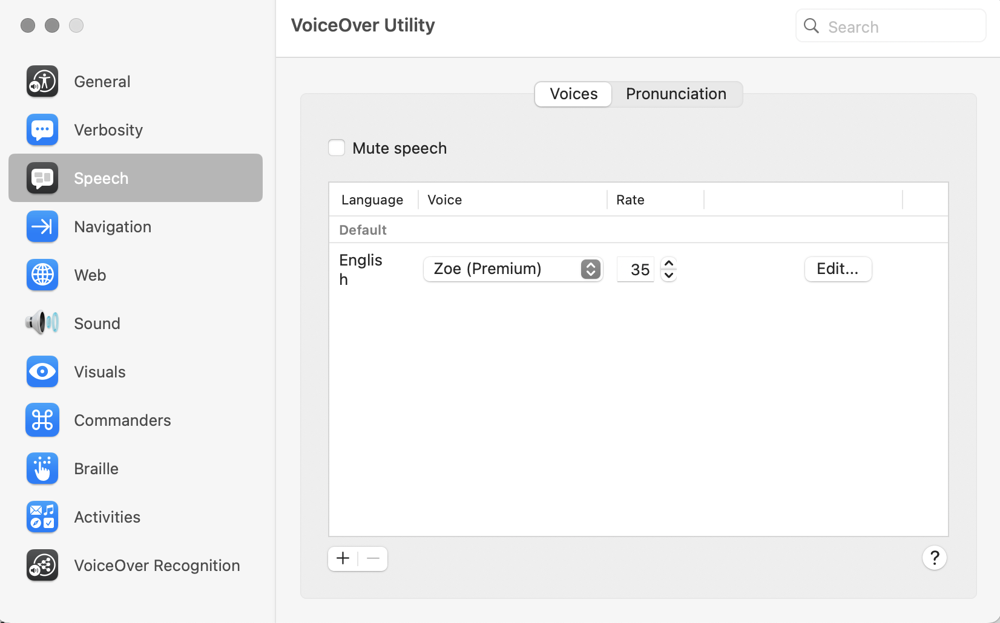

## Voice-over dialogue and training

Your mac comes with a tutorial for VoiceOver. To use it press `Command-F5` to open the voiceOver dialogue:

click `Learn More`

## 3 VoiceOver modifier:

You can find out the keyboard mapping of VoiceOver modifier in `VoiceOver utility`

`System setting` > search "voiceover utility".

click `Open VoiceOver Utility...` and you will see your VoiceOver modifier mapping:

**If you already know your VoiceOver mapping, you can access this menu with `VO-F8`.**

## 4 VoiceOver keyboard Help:

Press `VO-K` will enter the keyboard help mode.  
Press `[escape]` key to exit the keyboard help.

When you are in keyboard help mode, press `VO` then follows with a key you want to get help, voiceOver will say the description of the key you requested. 

## 5 Move around the screen:

Press `VO-[Arrowkey]` to move around.

## 6 Adjust the voice:

The tutorial shows you how to configure the voice, but it is easier to configure this in 

`VoiceOver Utility` > `Speech`

