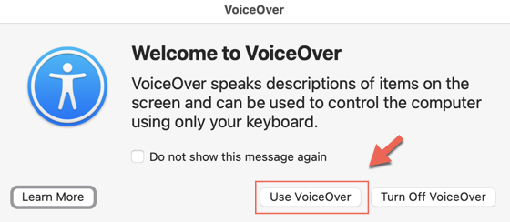
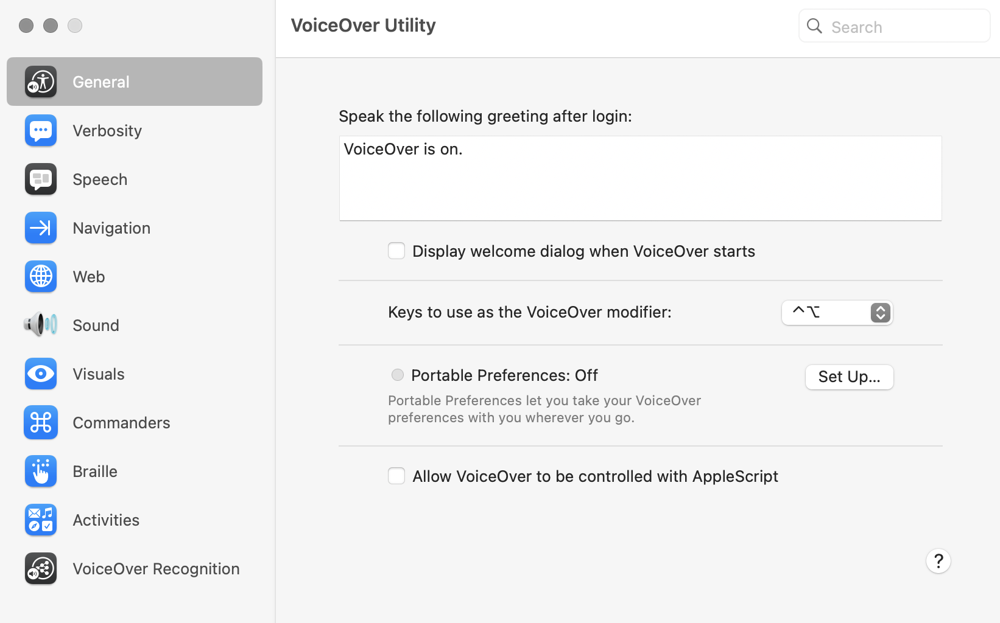
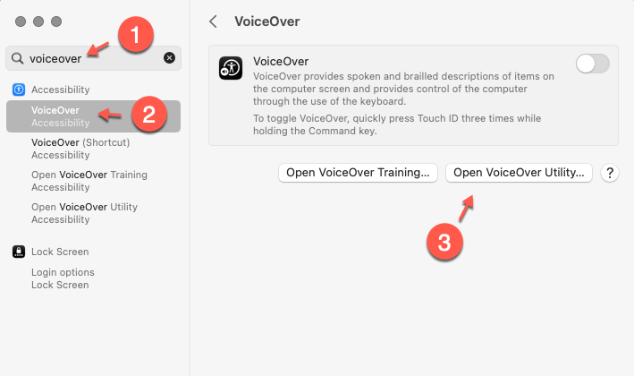
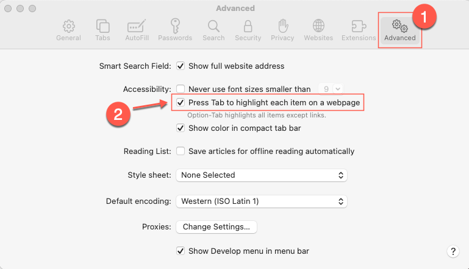

# VoiceOver

## How to activate VoiceOver

There are two keyboard shortcuts to activate VoiceOver:

1. Command-F5
2. Holding the Command key and press Touch ID 3 times quickly.

Both of these shortcut will give you the VoiceOver dialogue:





## How to configure VoiceOver

VoiceOver is configured via the *VoiceOver Utility* dialogue:



To access this dialogue, if VoiceOver is already activated and you know your VoiceOver modifier, you simply type:

```
VO-F8
```

Otherwise you can access the VoiceOver Utility by navigate using: 

```
Apple menu > System setting > Accessibility > VoiceOver
```

or search "voiceover" in the `System Setting`.



This will open the VoiceOver dialogue:


## Set up tab navigation in safari



